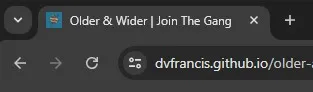
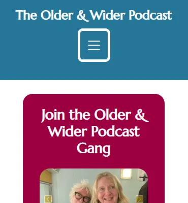
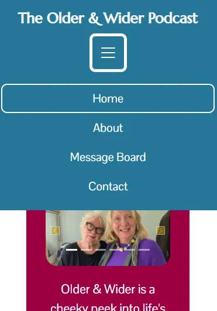
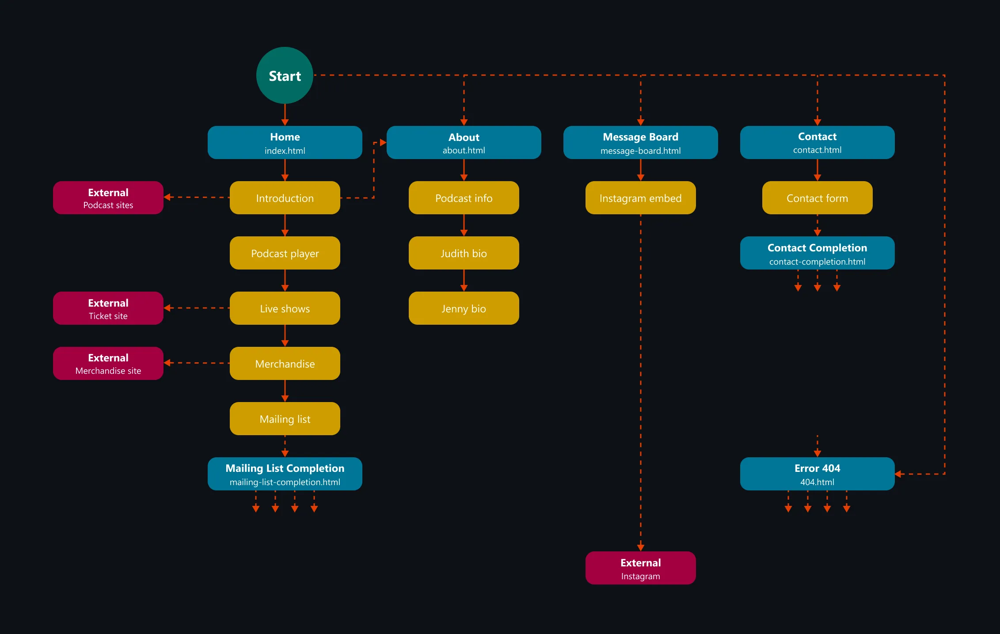
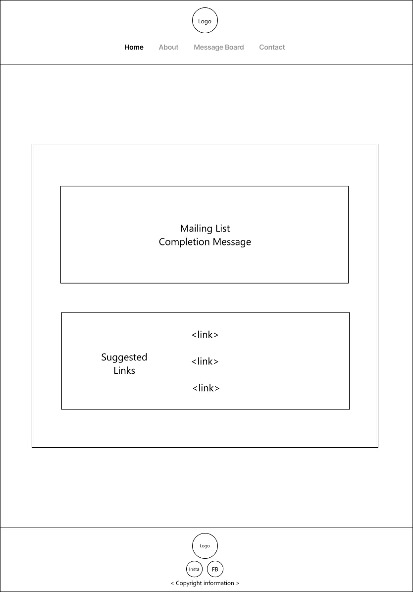

# The Older & Wider Podcast

## Overview

Older and Wider is a humorous (and [real](https://shows.acast.com/older-and-wider-podcast)) podcast, where two friends chat and share their day-to-day experiences as older women. It is hosted by retired television producer/writer, Judith Holder, and award-winning comedian, Jenny Eclair.

The purpose of the website is to give interested parties insights and information about the podcast, and will include an embedded podcast player, details on live events, and access to the popular Instagram page; it also provides a way to contact the podcast directly, share stories, and make suggestions for the show.

### Background Information

There are several references scattered across the site which refer back to items that are regularly mentioned, or discussed, on the podcast:

- Older and Wider Listeners are called OWLs.
- Anyone listening to the podcast is regarded as "part of the gang", or a "gang member".
- Snore Law is invoked by either Jenny or Judith when they feel the conversation has got too boring; this is usually accompanied by a loud snoring noise.
- Jenny and Judith both love coleslaw, and it is mentioned frequently.
- When people contact the podcast, Jenny and Judith insist that people include their age with fractions; for example, "This email is from Sarah who is 59 and three quarters" (this is why the age field on the contact form is a text input).
- Jenny and Judith have stated that a Breton top is the de facto uniform of an OWL.
- Jenny and Judith regularly refer to the podcast Instagram page as the "message board".
- There are a couple of regular podcast features:
    - Culture corner - Jenny and Judith discuss any books they are reading, television they've enjoyed, visits to art galleries, etc.
    - Taste sensations - Jenny and Judith discuss any amazing meals they may have had in the previous week.

### Site Preview

### Site Link

[here]: https://dvfrancis.github.io/older-and-wider
The Github Pages live site can be accessed [here].

## Index

1. [Overview](#the-older-and-wider-podcast)
    1. [Background Information](#background-information)
    2. [Site Preview](#site-preview)
    3. [Site Link](#site-link)
2. [User Experience Design](#user-experience-design)
    1. [Strategy](#strategy)
        1. [User Experience](#user-experience)
        2. [User Expectations](#user-expectations)
        3. [User Stories](#user-stories)
    2. [Scope](#scope)
        1. [Existing Features](#existing-features)
        2. [Future Features](#future-features)
    3. [Structure](#structure)
        1. [User Flow Diagram](#user-flow-diagram)
    4. [Skeleton](#skeleton)
        1. [Wireframes](#wireframes)
            1. [Mobile](#mobile)
            2. [Mobile with Expanded Menu](#mobile-with-expanded-menu)
            3. [Tablet](#tablet)
            4. [Desktop](#desktop)
    5. [Surface](#surface)
        1. [Colours](#colours)
        2. [Typography](#typography)
        3. [Media](#media)
        4. [Content](#content)
3. [Testing](#testing)
4. [Deployment](#deployment)
    1. [GitHub Pages](#github-pages)
    2. [Forks](#forks)
    3. [Local Clones](#local-clones)
    4. [Gitpod Workspaces](#gitpod-workspaces)
5. [Credits and References](#credits-and-references)
6. [Technologies Used](#technologies-used)
7. [Acknowledgements](#acknowledgements)

## User Experience Design

### Strategy

#### User Experience

- Target audience

    - Women over 60 (but anyone welcome).
    - Are mature individuals, with lots of life experience.
    - May have children and grandchildren.
    - Might still be working or retired.
    - Could be anyone looking for information about the podcast.
 
#### User Expectations

- An accessible and responsive website.
- Relevant information that is easily found.
- Simple website navigation.
- A way to get in touch with the podcast, to share experiences.
- An experience that matches existing expectations of what to expect from a website; for example, links are easy to identify and function as expected.
- An appealing visual design.

#### User Stories

- First time visitor goals:

    - "What is the Older and Wider podcast about?"
    - "Who is Jenny Eclair?"
    - "Who is Judith Holder?"
    - "Where can I listen to the Older and Wider Podcast"
    - "When are episodes of the Older and Wider podcast released?"

- Returning visitor goals:

    - "I want to find out more background information about the Older and Wider podcast"
    - "What was mentioned during the 'Culture Corner' segment of this week's show?"
    - "Has the podcast won any awards?"
    - "What is the 'Message Board' - it was mentioned by Jenny and Judith in this week's episode, but where can I access it?"

- Frequent visitor goals:

    - "How can I contact Jenny and Judith to share my experiences, or comment on an item that was mentioned in the show?"
    - "Is there any podcast merchandise available?"
    - "Can I watch the podcast being performed live?"

### Scope

#### Existing Features

- General

    - All pages will be responsive at different screen sizes, and change layout accordingly and appropriately.
    - All screenshots shown in this section were taken from the desktop site, to give the clearest examples possible (apart from the Header section which also shows the header as seen on mobile devices, with a hamburger menu). 

- Browser Tab Icon:

    - A custom HTML favicon will be shown to aid users' identification of the site. It will also appear whenever someone adds the site as a bookmark or favourite.

        

- Header:

    - Fixed at the top of each page - contains the site name and navigation.
    - The header allows the user to identify where they are on the site.
    - Plain background colour with contrasting text.
    - Site name will be centred in the first row, and link back to the home page when clicked.
    - Navigation bar will be centred in the second row, beneath the site name, and contain links to:
        - Home - this takes the user back to the home page when clicked.
        - About - this takes the user to a page with information about the podcast and both hosts.
        - Message Board - this takes the user to a page with the podcast's embedded Instagram profile.
        - Contact - this takes the user to a contact form that can be completed to send a message to the podcast hosts.
    - The currently active page is indicated on the navigation bar.
    - The header as it appears on desktops:

        

    - The header as it appears on mobile:

        

    - and with expanded hamburger menu:

        

- Footer:

    - Fixed at the bottom of each page - it contains the social media icons, and legal information.
    - The footer allows the user to jump to the social media properties of the podcast.
    - Plain background colour with contrasting text.
    - Social media icons are centred in the first row.
    - Legal information is centred in the second row.
    - On hover, each social media icon will change colour, and also when clicked. The legal links only change colour on hover:

                

- Home (index):

    - This is the first page a user sees when they enter the site. It contains all pertinent information regarding the podcast, with links to other pages where required.
    - The home page allows the user to get a good overview of the purpose of the podcast and gives them glimpses of associated activities.
    - The page has an introduction to the podcast, a carousel of images, a podcast player, information about the live shows, a link to an external merchandise website, and a mailing list signup form.
    - The live shows section has an explanation of the live shows, and a button that, when clicked, will open a new tab to the ticket site.
    - The merchandise section has a button that, when clicked, takes the user to the merchandise website via a new tab.
    - In the mailing list section, the user has the opportunity to sign-up for a regularly released newsletter.

        

- Mailing List Completion:

    - A custom completion page appears once 'Send' is clicked on the mailing list signup form on the home page, with suggested links to other parts of the site.
    - The page will add humour to the site while offering suggested links to other pages on the site.
    - After 30 seconds, the page will redirect automatically to the home page.

        

- About:

    - This section contains more detailed information about the podcast's purpose and the people behind it. It helps the user to understand the motivations behind the creation and continuation of the podcast.
    - Sections are:
        - Information about the podcast.
        - Biography of Jenny Eclair.
        - Biography of Judith Holder.

        

- Message Board:

    - The "message board" page allows the user to read posts on the Instagram page without having to navigate away from the site, so keeping them on the site for longer.
    - The podcast's Instagram profile is embedded on this page.

        

- Contact:

    - The 'Contact' page allows the user to send a message to the podcast hosts, helping them to feel involved in the podcast, it contains:
        - First Name field - for user's first name.
        - Last Name field - for user's last name.
        - Age field (a text input that allows people to enter their age as, for example, "58 and a half" – a running joke on the podcast).
        - Message field - for users to enter their message.
        - Send button - users can click this button to send their message.
        - Reset button - users can click this button to clear any information already entered on the form.
    - All fields have validation where appropriate.
    - Text input fields all have placeholder text.
    - All inputs are required.

        
    
- Contact Completion:

    - A custom completion page appears once 'Send' is clicked on the Contact page, with suggested links to other parts of the site.
    - The page will add humour to the site while offering suggested links to other pages on the site.
    - After 30 seconds, the page will redirect automatically to the home page.

        

- Custom 404:
    - A custom 404 error page appears whenever a user attempts to navigate to a non-existent page.
    - The page will add humour to the site while offering suggested links to other pages on the site.
    - After 30 seconds, the page will redirect automatically to the home page.

        

#### Future Features

- The addition of a website forum would allow fans of the podcast to interact, discuss the show, and share their life experiences.

### Structure

#### User Flow diagram

This diagram shows how the user may interact and navigate through the website; dashed lines indicate optional routes.

### Skeleton

#### Wireframes

After I created the wireframes, and was bulding the site, I altered the layout of the header and footer so that the logo was replaced by a centred site title in the header but removed from the footer.

The hamburger menu (shown in the header on smaller mobile devices) was also centred on the screen.

The wireframes presented here show my initial ideas:

##### Mobile

###### Home

###### Mailing List Completion

###### About

###### Message Board

###### Contact

###### Contact Completion

###### Custom 404

##### Mobile (with expanded menu)

###### Home

###### Mailing List Completion

###### About

###### Message Board

###### Contact

###### Contact Completion

###### Custom 404

##### Tablet

###### Home

###### Mailing List Completion

###### About

###### Message Board

###### Contact

###### Contact Completion

###### Custom 404

##### Desktop

###### Home

###### Mailing List Completion

###### About

###### Message Board

###### Contact

###### Contact Completion

###### Custom 404

### Surface

#### Colours

The following colours have been used to add interesting backgrounds to site sections, with white (#FFF) as a contrasting colour, which is also used for all text:

[Facebook Light Blue (#17A9FD) and Facebook Dark Blue (#0165E1)]:https://brandpalettes.com/facebook-colors
[Instagram Rose (#E1306C) and Instagram Purple Red (#C13584)]: https://brandpalettes.com/instagram-color-codes

For the the hover and active link states of each social media icon I used:

- [Facebook Light Blue (#17A9FD) and Facebook Dark Blue (#0165E1)].
- [Instagram Rose (#E1306C) and Instagram Purple Red (#C13584)].

The colours used are taken from palette 389 of the [Sarah Renae Clarke Colour Catalogue, Volume 2](https://sarahrenaeclark.com/shop/the-color-catalog-volume-2/).

#### Typography

Fonts were chosen from Google Fonts:
  
- [Marcellus](https://fonts.google.com/specimen/Marcellus) was used for H1 and H2 tags.
- [Pontano Sans](https://fonts.google.com/specimen/Pontano+Sans) was used for all other body text.

#### Media

All images used on the site have been taken from the Older & Wider podcast [Instagram](https://www.instagram.com/olderandwiderpodcast) page and [merchandise website](https://olderandwidershop.com).

For the image carousels that appear on index.html and about.html, I used [RespImageLint](https://ausi.github.io/respimagelint/) to advise about creating alternates for all images, that would be appropriate at different screens sizes. This was then implemented using the HTML `img` `srcset` attribute for each image used.

#### Content

All page content was initially written by myself, inspired by the sources listed in the credits, and then polished using Copilot in Microsoft Edge.

## Testing

- Please refer to [TESTING.md](TESTING.md) for details.

## Deployment

### GitHub Pages

The site was deployed using GitHub Pages, as follows:

- Navigate to the GitHub repository.
- Click 'Settings'.
- Under 'Code and automation', select 'Pages'.
- On the 'GitHub Pages' section, under 'Build and deployment > Source' select 'Deploy from a branch'.
- Ensure that the 'main' branch has been selected, and then click 'Save'.

### Forks

To copy the repository to your own GitHub account, so you can make changes without affecting the original version, you can fork it:

- Navigate to the GitHub repository.
- Just above the 'About' section, on the right of the page, click the 'Fork' button.

### Local Clones

To deploy the project on your own computer you can clone it:

- Navigate to the GitHub repository.
- Click the green '<> Code' button above the list of project files.
- From the 'Local' tab, select either HTTPS, SSH, or GitHub CLI as the method of cloning, and copy the associated link.
- Open the terminal or Bash prompt.
- Navigate to the directory where you want to store the cloned copy.
- At the prompt, type `git clone` and add the string copied earlier.
- Press 'Enter' to create the copy.

### Gitpod Workspaces

When using Gitpod, you can click the button below to create a workspace from this repository, which also requires that you [install the Gitpod browser extension](https://www.gitpod.io/docs/configure/user-settings/browser-extension).

## Credits and References

All images on this site are taken from either the podcast's [Instagram](https://www.instagram.com/olderandwiderpodcast/) page or [merchandise website](https://olderandwidershop.com/). Links to live sites are also used for the social media icons, and in the footer. This is done to help promote the podcast, and as a mark of respect for all the work that has gone into it. Once this project has been assessed, my intention is to get in touch with the podcast to let Jenny and Judith know about it.

The following references were used for general advice and help in implementing specific functionality on the website:
- [Duckett, J. (2011) HTML & CSS - Design and Build Websites. Indianapolis: John Wiley & Sons, Inc.](https://htmlandcssbook.com/) - general coding advice.
- [Microsoft Edge Copilot](https://www.microsoft.com/en-us/edge/features/copilot) - coding advice, particularly around CSS rules of ingeritance.
- [How to create a copyright symbol](https://blog.hubspot.com/website/html-code-copyright) - creating the copyright symbol in the footer.
- [How to set a favicon in GitHub Pages]( https://stackoverflow.com/questions/35037482/favicon-with-github-pages) - setting a favicon on GitGub Pages.
- [W3 Schools CSS :visited Selector](https://www.w3schools.com/cssref/sel_visited.php) and 
 [CSS-Tricks :visited](https://css-tricks.com/almanac/selectors/v/visited/) - styling the navigation links after they had been visited.
- [Background on semantic HTML5 elements](https://www.freecodecamp.org/news/semantic-html5-elements/) - ordering semantic HTMl elements.
- [Redirect to custom form completion page](https://developer.mozilla.org/en-US/docs/Web/HTTP/Redirections?ref=library.linkbot.com) - creating a redirect from the website's custom completion pages.
- [How to Implement ARIA Tags for Better Accessibility](https://dev.to/sarveshh/how-to-implement-aria-tags-for-better-accessibility-a-comprehensive-guide-for-web-developers-h3k) - how and where to use ARIA tags.
- [Using Media queries](https://developer.mozilla.org/en-US/docs/Web/CSS/CSS_media_queries/Using_media_queries) - creating media queries to control ``body`` padding at different screen sizes.
- [Creating a custom 404 page for your GitHub Pages site](https://docs.github.com/en/pages/getting-started-with-github-pages/creating-a-custom-404-page-for-your-github-pages-site) - implementing a GutHub Pages custom 404 page.
- [How To Change the Color of the Bootstrap 5 Mobile Menu Icon](https://www.youtube.com/watch?v=45QSuJaHEss) - altering the colour of the hamburger menu on mobile devices.
- [How to use srcset and sizes for responsive images](https://stackoverflow.com/questions/35099471/how-to-use-srcset-and-sizes-for-responsive-images) - making the website's image carousels more responsive.
- [The Only Markdown Cheatsheet You Need](https://github.com/im-luka/markdown-cheatsheet) - creating the README.md and TESTING.md documentation.

References used to gain a general understanding about the podcast, and for creating website content:

- [Jenny Eclair's website](https://jennyeclair.com)
- [Jenny Eclair's Wikipedia page](https://en.wikipedia.org/wiki/Jenny_Eclair)
- [Interview in The Guardian with Jenny Eclair](https://www.theguardian.com/stage/2020/jun/28/jenny-eclair-menopause-gave-me-incandescent-rage-it-was-like-a-superpower)
- [Jenny Eclair's Amazon author profile](https://www.amazon.co.uk/stores/author/B001KDFYU2/allbooks)
- [Judith Holder's website](http://www.judithholder.com/)
- [Interview in The Guardian with Judith Holder](https://www.theguardian.com/lifeandstyle/2023/aug/14/a-new-start-after-60-i-came-out-of-my-shell-when-i-retired-now-im-a-podcast-star-at-67)
- [Interview in Readers Digest with Judith Holder](https://www.readersdigest.co.uk/inspire/life/under-the-grandfluence-judith-holder)
- [Judith Holder's Amazon author profile](https://www.amazon.co.uk/stores/author/B001KJ46JG?ingress=0&visitId=2980f5c1-ed6a-45d2-ab5b-16abd95eaa16&ref_=sr_ntt_srch_lnk_1)
- [Wikipedia entry about 'Grumpy Old Women'](https://en.wikipedia.org/wiki/Grumpy_Old_Women)
- [The Older & Wider Facebook](https://www.facebook.com/profile.php?id=61555198800248)
- [Older & Wider Live! Avalon Press Release #1](https://avalonuk.com/2023/03/23/jenny-eclair-and-judith-holder-co-writers-of-internationally-successful-grumpy-old-women-live-stage-shows-bring-their-podcast-series-older-and-wider-to-the-london-stage-this-summer/)
- [Older & Wider Live! Avalon Press Release #2](https://avalonuk.com/2023/03/29/extra-london-date-at-leicester-square-theatre-announced-for-jenny-eclair-and-judith-holders-older-and-wider-live-podcast-show/)
- [Older & Wider Live! Theatre at The Tabard](https://tabard.org.uk/whats-on/olderandwider/)
- [What's On Stage - Older & Wider Live!](https://www.whatsonstage.com/shows/outer-london-theatre/older-and-wider-live_300423/)
- [UKTW - Older & Wider Live!](https://www.uktw.co.uk/archive/Tour/Talk/Older-and-Wider-live/T833145318/)
- [The Lowry - Older & Wider Live!](https://thelowry.com/whats-on/older-and-wider-live-jenny-eclair-and-judith-holder/)
- [See Tickets - Older & Wider Live!](https://www.seetickets.com/tour/older-and-wider-live)

Links to the podcast, on various platforms:

- [Acast](https://shows.acast.com/older-and-wider-podcast)
- [Apple Podcasts](https://podcasts.apple.com/gb/podcast/older-and-wider-podcast/id1446310659)
- [Spotify](https://open.spotify.com/show/3ScVA6cJZpMifpJJDmmodP)
- [Soundcloud](https://soundcloud.com/user-575974822)
    
## Technologies Used

- The website was built using [HTML](https://en.wikipedia.org/wiki/HTML), [CSS](https://en.wikipedia.org/wiki/CSS), and [Bootstrap.](https://en.wikipedia.org/wiki/Bootstrap_(front-end_framework))
- [JavaScript](https://en.wikipedia.org/wiki/JavaScript) was not specifically used except where it was required for Bootstrap, particularly in making responsive menus work on mobile devices.
- [Google Chrome Developer Tools](https://developer.chrome.com/docs/devtools/) was used for website troubleshooting, and testing (including [Lighthouse](https://developer.chrome.com/docs/lighthouse/overview/) reports).
- [Google Chrome](https://www.google.co.uk/chrome/) was used for website testing.
- The [Responsive Viewer](https://responsiveviewer.org/) extension was used in all browsers (except Firefox, which does not seem to support it) to create images of the website's pages on a variety of devices.
- The [GoFullPage](https://gofullpage.com/) extension was used in all browsers (except Firefox, which does not seem to support it) to capture full-sized images of the website's pages.
- [Microsoft Edge](https://www.microsoft.com/en-gb/edge/) was used for website testing.
- [Firefox](https://www.mozilla.org/en-GB/firefox/new/) was used for website testing.
- [Opera](https://www.opera.com/) was used for website testing.
- [Safari](https://www.apple.com/uk/safari/) was used for website testing, and mobile screenshots ofan iPhone 12 Pro Max and iPad Pro (12.9-inch) (2nd generation).
- [Figma](https://www.figma.com/) was used to create the wireframes and the user flow diagram.
- [Elfsight](https://elfsight.com/) was used to create the Instagram embed code for message-board.html.
- [Sarah Renae Clarke's Colour Catalogue V2](https://sarahrenaeclark.com/color-palettes/) was used to determine the website's colur scheme.
- [Font Joy](https://fontjoy.com/) was used to determine font pairings.
- [Google Fonts](https://fonts.google.com/) was used to source the Marcellus and Pontano Sans fonts.
- [Brand Palettes](https://brandpalettes.com) was used to source the correct Instagram and Facebook colours.
- [Microsoft Photos](https://apps.microsoft.com/detail/9wzdncrfjbh4?hl=en-gb&gl=US) was used to edit all images.
- [RespImageLint](https://ausi.github.io/respimagelint/) was used to ensure all website images were fully responsive.
- [To WebP](https://towebp.io/) was used to compress images into webp format.
- [FontAwesome](https://fontawesome.com/) was used for social media icons.
- [GitHub](https://github.com/) was used for version control.
- [GitHub Pages](https://pages.github.com/) was used to host the website.
- [Gitpod](https://gitpod.io/) was used as an online IDE.
- [Markdown](https://en.wikipedia.org/wiki/Markdown) was used to create the README.md and TESTING.md documentation.

## Acknowledgements

Thanks to my mentor, Juliia Konovalova, my cohort facilitator, Lewis Dillon, and fellow student cohorts, in particular Luke McCall, for their support and advice.

Extra special thanks to Andrew Parton, for always being there.
