[Return to Older & Wider README.md](https://github.com/dvfrancis/older-and-wider/blob/main/README.md)

# Testing

## Index

1. [Code Validation](#code-validation)
    1. [HTML](#html)
        1. [index.html](#indexhtml)
        2. [mailing-list-completion.html](#mailing-list-completionhtml)
        3. [about.html](#abouthtml)
        4. [message-board.html](#message-boardhtml)
        5. [contact.html](#contacthtml)
        6. [contact-completion.html](#contact-completionhtml)
        7. [404.html](#404html)
    2. [CSS](#css)
        1. [index.html](#indexhtml-1)
        2. [mailing-list-completion.html](#mailing-list-completionhtml-1)
        3. [about.html](#abouthtml-1)
        4. [message-board.html](#message-boardhtml-1)
        5. [contact.html](#contacthtml-1)
        6. [contact-completion.html](#contact-completionhtml-1)
        7. [404.html](#404html-1)
2. [Manual Validation](#manual-validation)
    1. [index.html](#indexhtml-2)
    2. [mailing-list-completion.html](#mailing-list-completionhtml-2)
    3. [about.html](#abouthtml-2)
    4. [message-board.html](#message-boardhtml-2)
    5. [contact.html](#contacthtml-2)
    6. [contact-completion.html](#contact-completionhtml-2)
    7. [404.html](#404html-2)
3. [User Story Validation](#user-story-validation)
4. [Browser Compatibility](#browser-compatibility)
5. [Accessibility](#accessibility)
6. [Responsiveness](#responsiveness)
7. [Performance](#performance)
8. [Bugs](#bugs)
9. [Unfixed Bugs](#unfixed-bugs)

## Code Validation

### HTML

Below are the results of HTML validation for each page, using the [W3C Markup Validation Service](https://validator.w3.org):

#### index.html

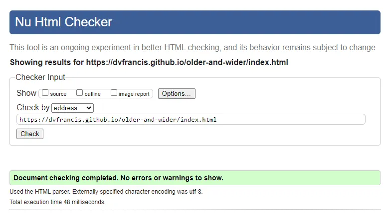

#### mailing-list-completion.html

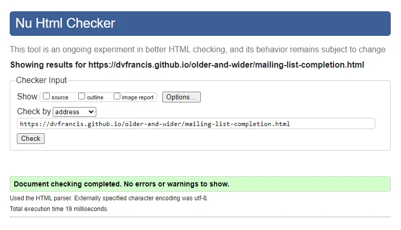

#### about.html

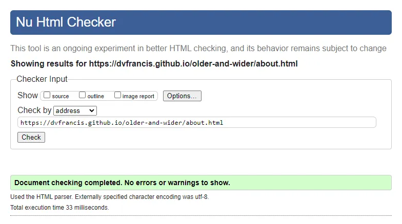

#### message-board.html

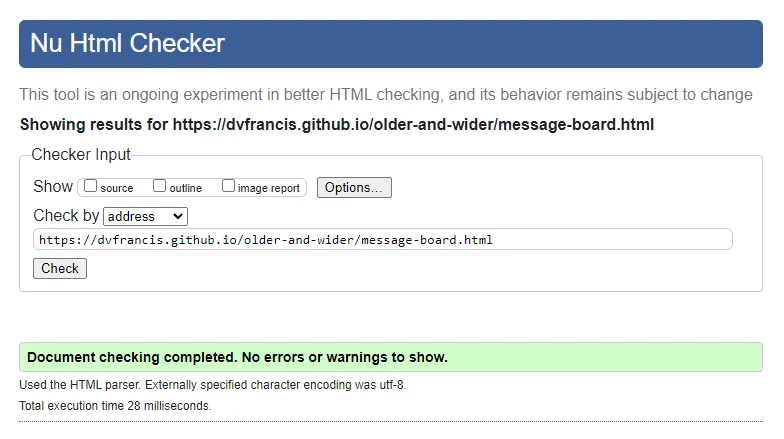

#### contact.html

#### contact-completion.html

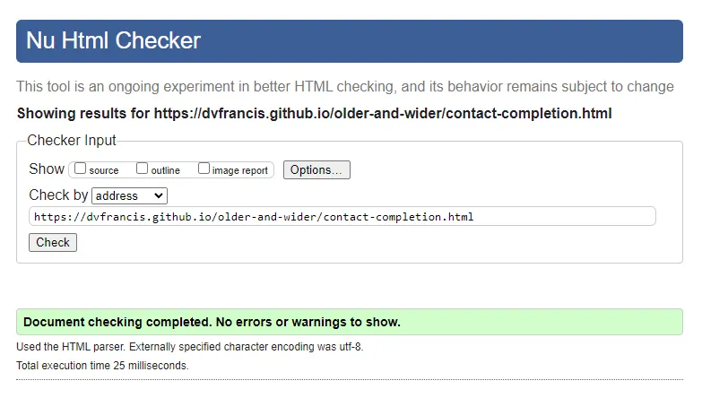

#### 404.html

### CSS

Below are the results of CSS validation for each page, using the [W3C CSS Validation Service](https://jigsaw.w3.org/css-validator):

#### index.html

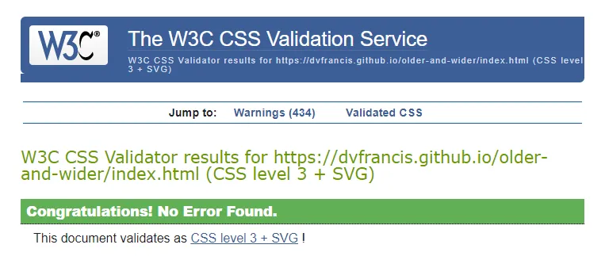

#### mailing-list-completion.html

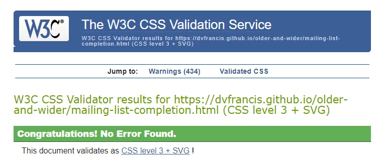

#### about.html

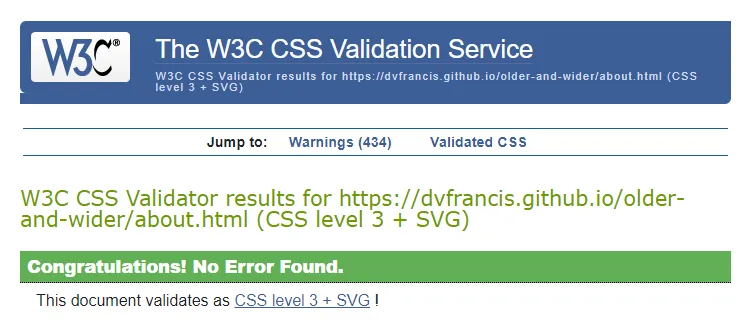

#### message-board.html

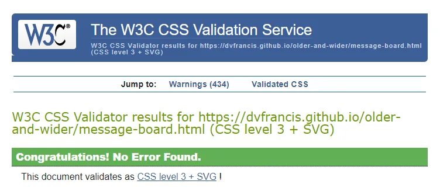

#### contact.html

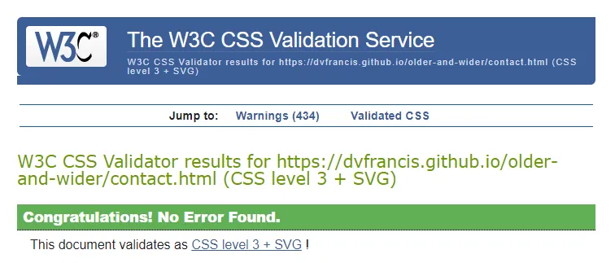

#### contact-completion.html

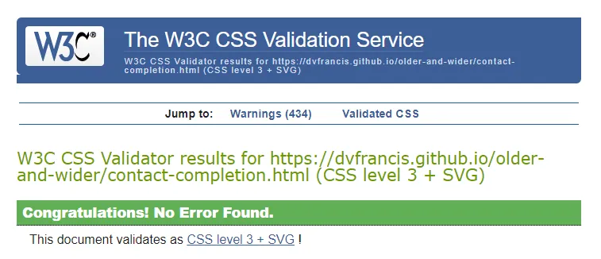

#### 404.html

## Manual Validation

Here are the results of a manual test of all links, and any form fields, for each page:

### index.html

| Item | Process | Expected Result | Actual Result | Status |
| --- | --- | --- | --- | --- |
| Site title - "The Older & Wider Podcast" | Click to return to index.html | The user is redirected to index.html (even if already there) | The user is redirected to index.html (even if already there) | PASS |
| Navigation bar link - "Home" | Click to open index.html | The user is redirected to index.html (even if already there) | The user is redirected to index.html (even if already there) | PASS |
| Navigation bar link - "About" | Click to open about.html | The user is redirected to about.html (even if already there) | The user is redirected to about.html (even if already there) | PASS |
| Navigation bar link - "Message Board" | Click to open message-board.html | The user is redirected to message-board.html (even if already there) | The user is redirected to message-board.html (even if already there) | PASS |
| Navigation bar link - "Contact"" | Click to open contact.html | The user is redirected to contact.html (even if already there) | The user is redirected to contact.html (even if already there) | PASS |
| Image carousel | Use arrow and indicator controls to move between all image slides | Slides transition succesfully | Slides transition succesfully | PASS |
| Button - "About the Podcast" | Click to move to about.html | The user is redirected to the about page | The user is redirected to the about page | PASS |
| Podcast player | Click play to play the podcast, and then click pause to pause playback | Playback begins or ends | Playback begins or ends | PASS |
| Button - "Buy Tickets" | Click to open external website in new tab | The link opens in a new tab | The link opens in a new tab | PASS |
| Button - "See the Merch" | Click to open external website in new tab | The link opens in a new tab | The link opens in a new tab | PASS |
| "Mailing List" - using a valid email | Enter a valid email address and click 'Send' | The email address is accepted and the user redirected to mailing-list-completion.html  | The email is accepted and the user is redirected to mailing-list-completion.html | PASS |
| "Mailing List" - using an invalid email | Enter an invalid email address and click 'Send' | The email address is rejected  | The email is rejected | PASS |
| Social media icon - Instagram | Click to open the Older & Wider Instagram page in a new tab  | The link opens in a new tab  | The link opens in a new tab | PASS |
| Social media icon - Facebook | Click to open the Older & Wider Facebook page in a new tab  | The link opens in a new tab  | The link opens in a new tab | PASS |
| Footer link - "Dominic Francis" | Click to open dominicfrancis.co.uk in a new tab | The link opens in a new tab  | The link opens in a new tab | PASS |
| Footer link - "Older & Wider" | Click to open the Acast Older & Wider website in a new tab | The link opens in a new tab  | The link opens in a new tab | PASS |
| Footer link - "Acast" | Click to open the Acast website in a new tab | The link opens in a new tab  | The link opens in a new tab | PASS |

### mailing-list-completion.html

| Item | Process | Expected Result | Actual Result | Status |
| --- | --- | --- | --- | --- |
| Site title - "The Older & Wider Podcast" | Click to return to index.html | The user is redirected to index.html (even if already there) | The user is redirected to index.html (even if already there) | PASS |
| Navigation bar link - "Home" | Click to open index.html | The user is redirected to index.html (even if already there) | The user is redirected to index.html (even if already there) | PASS |
| Navigation bar link - "About" | Click to open about.html | The user is redirected to about.html (even if already there) | The user is redirected to about.html (even if already there) | PASS |
| Navigation bar link - "Message Board" | Click to open message-board.html | The user is redirected to message-board.html (even if already there) | The user is redirected to message-board.html (even if already there) | PASS |
| Navigation bar link - "Contact"" | Click to open contact.html | The user is redirected to contact.html (even if already there) | The user is redirected to contact.html (even if already there) | PASS |
| Auto redirect (after 30 seconds) | The page is automatically redirected to index.html after 30 seconds have elapsed | The index.html page loads after 30 seconds | The index.html page loads after 30 seconds | PASS |
| Button - "Return to the home page" | Click to move to index.html | The user is redirected to the home page | The user is redirected to the home page | PASS |
| Button - "Learn about the podcast" | Click to move to about.html | The user is redirected to the about page | The user is redirected to the about page | PASS |
| Button - "View the 'Message Board'" | Click to move to message-board.html | The user is redirected to the message board page | The user is redirected to the message board page | PASS |
| Button - "Why not send us a message?" | Click to move to contact.html | The user is redirected to the contact page | The user is redirected to the contact page | PASS |
| Social media icon - Instagram | Click to open the Older & Wider Instagram page in a new tab  | The link opens in a new tab  | The link opens in a new tab | PASS |
| Social media icon - Facebook | Click to open the Older & Wider Facebook page in a new tab  | The link opens in a new tab  | The link opens in a new tab | PASS |
| Footer link - "Dominic Francis" | Click to open dominicfrancis.co.uk in a new tab | The link opens in a new tab  | The link opens in a new tab | PASS |
| Footer link - "Older & Wider" | Click to open the Acast Older & Wider website in a new tab | The link opens in a new tab  | The link opens in a new tab | PASS |
| Footer link - "Acast" | Click to open the Acast website in a new tab | The link opens in a new tab  | The link opens in a new tab | PASS |

### about.html

| Item | Process | Expected Result | Actual Result | Status |
| --- | --- | --- | --- | --- |
| Site title - "The Older & Wider Podcast" | Click to return to index.html | The user is redirected to index.html (even if already there) | The user is redirected to index.html (even if already there) | PASS |
| Navigation bar link - "Home" | Click to open index.html | The user is redirected to index.html (even if already there) | The user is redirected to index.html (even if already there) | PASS |
| Navigation bar link - "About" | Click to open about.html | The user is redirected to about.html (even if already there) | The user is redirected to about.html (even if already there) | PASS |
| Navigation bar link - "Message Board" | Click to open message-board.html | The user is redirected to message-board.html (even if already there) | The user is redirected to message-board.html (even if already there) | PASS |
| Navigation bar link - "Contact"" | Click to open contact.html | The user is redirected to contact.html (even if already there) | The user is redirected to contact.html (even if already there) | PASS |
| Image carousel for "What is Older & Wider?" | Use arrow and indicator controls to move between all image slides | Slides transition succesfully | Slides transition succesfully | PASS |
| Image carousel for "Who is Judith Holder" | Use arrow and indicator controls to move between all image slides | Slides transition succesfully | Slides transition succesfully | PASS |
| Image carousel for "Who is Jenny Eclair?" | Use arrow and indicator controls to move between all image slides | Slides transition succesfully | Slides transition succesfully | PASS |
| Social media icon - Instagram | Click to open the Older & Wider Instagram page in a new tab  | The link opens in a new tab  | The link opens in a new tab | PASS |
| Social media icon - Facebook | Click to open the Older & Wider Facebook page in a new tab  | The link opens in a new tab  | The link opens in a new tab | PASS |
| Footer link - "Dominic Francis" | Click to open dominicfrancis.co.uk in a new tab | The link opens in a new tab  | The link opens in a new tab | PASS |
| Footer link - "Older & Wider" | Click to open the Acast Older & Wider website in a new tab | The link opens in a new tab  | The link opens in a new tab | PASS |
| Footer link - "Acast" | Click to open the Acast website in a new tab | The link opens in a new tab  | The link opens in a new tab | PASS |

### message-board.html

| Item | Process | Expected Result | Actual Result | Status |
| --- | --- | --- | --- | --- |
| Site title - "The Older & Wider Podcast" | Click to return to index.html | The user is redirected to index.html (even if already there) | The user is redirected to index.html (even if already there) | PASS |
| Navigation bar link - "Home" | Click to open index.html | The user is redirected to index.html (even if already there) | The user is redirected to index.html (even if already there) | PASS |
| Navigation bar link - "About" | Click to open about.html | The user is redirected to about.html (even if already there) | The user is redirected to about.html (even if already there) | PASS |
| Navigation bar link - "Message Board" | Click to open message-board.html | The user is redirected to message-board.html (even if already there) | The user is redirected to message-board.html (even if already there) | PASS |
| Navigation bar link - "Contact"" | Click to open contact.html | The user is redirected to contact.html (even if already there) | The user is redirected to contact.html (even if already there) | PASS |
| Instagram embed - "Older and Wider Podcast" header | Click to open the Older & Wider Instagram page in a new tab | The link opens in a new tab  | The link opens in a new tab | PASS |
| Instagram embed button - "Follow" | Click to open the Older & Wider Instagram page in a new tab | The link opens in a new tab  | The link opens in a new tab | PASS |
| Instagram embed - load more posts | Click navigation arrows on either side of the instagram embed to load more posts | More posts slide into view  | More posts slide into view | PASS |
| Instagram embed - view post | Click a post to open it in a pop-up window | The post opens in a pop-up window  | The post opens in a pop-up window | PASS |
| Instagram embed - scroll posts | Use a mouse wheel (on desktop) or a finger (on mobile) to scroll down through other posts, from within a post's pop-up window | Further posts are shown  | Further posts are shown | PASS |
| Instagram embed - close post | Use a mouse wheel (on desktop) or a finger (on mobile) to click the cross in the top-right of a post's pop-up window | The post's pop-up window closes  | The post's pop-up window closes | PASS |
| Social media icon - Instagram | Click to open the Older & Wider Instagram page in a new tab  | The link opens in a new tab  | The link opens in a new tab | PASS |
| Social media icon - Facebook | Click to open the Older & Wider Facebook page in a new tab  | The link opens in a new tab  | The link opens in a new tab | PASS |
| Footer link - "Dominic Francis" | Click to open dominicfrancis.co.uk in a new tab | The link opens in a new tab  | The link opens in a new tab | PASS |
| Footer link - "Older & Wider" | Click to open the Acast Older & Wider website in a new tab | The link opens in a new tab  | The link opens in a new tab | PASS |
| Footer link - "Acast" | Click to open the Acast website in a new tab | The link opens in a new tab  | The link opens in a new tab | PASS |

### contact.html

| Item | Process | Expected Result | Actual Result | Status |
| --- | --- | --- | --- | --- |
| Site title - "The Older & Wider Podcast" | Click to return to index.html | The user is redirected to index.html (even if already there) | The user is redirected to index.html (even if already there) | PASS |
| Navigation bar link - "Home" | Click to open index.html | The user is redirected to index.html (even if already there) | The user is redirected to index.html (even if already there) | PASS |
| Navigation bar link - "About" | Click to open about.html | The user is redirected to about.html (even if already there) | The user is redirected to about.html (even if already there) | PASS |
| Navigation bar link - "Message Board" | Click to open message-board.html | The user is redirected to message-board.html (even if already there) | The user is redirected to message-board.html (even if already there) | PASS |
| Navigation bar link - "Contact"" | Click to open contact.html | The user is redirected to contact.html (even if already there) | The user is redirected to contact.html (even if already there) | PASS |
| Contact form - "First Name" | Where all other fields are empty, enter first name and click send | The user is prompted to enter their last name  | The user is prompted to enter their last name | PASS |
| Contact form - "Last Name" | Where all other fields are empty, except the first name, enter last name and click send | The user is prompted to enter their age  | The user is prompted to enter their age | PASS |
| Contact form - "Age" | Where all other fields are empty, except the first and last names, enter age and click send | The user is prompted to enter their email address  | The user is prompted to enter their email address | PASS |
| Contact form - "Email" - using an invalid email address | Where all other fields are empty, except the first name, last name, and age, enter an invalid email address and click 'Send' | The email address is rejected  | The email is rejected | PASS |
| Contact form - "Email" - using a valid email address | Where all other fields are empty, except the first name, last name, and age, enter a valid email address and click 'Send' | The user is prompted to enter a message  | The user is prompted to enter a message | PASS |
| Contact form - "Message" | Where all fields are completed correctly, enter a message and click 'Send' | The form is accepted and the user redirected to contact-completion.html  | The form is accepted and the user redirected to contact-completion.html | PASS |
| Contact form button - "Send" | Where all fields are completed correctly, click 'Send' | The form is accepted and the user redirected to contact-completion.html  | The form is accepted and the user redirected to contact-completion.html | PASS |
| Contact form button - "Reset" | Enter any information on the form, and click 'Reset' | The information on the form is cleared, ready for fresh data entry  | The information on the form is cleared, ready for fresh data entry | PASS |
| Social media icon - Instagram | Click to open the Older & Wider Instagram page in a new tab  | The link opens in a new tab  | The link opens in a new tab | PASS |
| Social media icon - Facebook | Click to open the Older & Wider Facebook page in a new tab  | The link opens in a new tab  | The link opens in a new tab | PASS |
| Footer link - "Dominic Francis" | Click to open dominicfrancis.co.uk in a new tab | The link opens in a new tab  | The link opens in a new tab | PASS |
| Footer link - "Older & Wider" | Click to open the Acast Older & Wider website in a new tab | The link opens in a new tab  | The link opens in a new tab | PASS |
| Footer link - "Acast" | Click to open the Acast website in a new tab | The link opens in a new tab  | The link opens in a new tab | PASS |

### contact-completion.html

| Item | Process | Expected Result | Actual Result | Status |
| --- | --- | --- | --- | --- |
| Site title - "The Older & Wider Podcast" | Click to return to index.html | The user is redirected to index.html (even if already there) | The user is redirected to index.html (even if already there) | PASS |
| Navigation bar link - "Home" | Click to open index.html | The user is redirected to index.html (even if already there) | The user is redirected to index.html (even if already there) | PASS |
| Navigation bar link - "About" | Click to open about.html | The user is redirected to about.html (even if already there) | The user is redirected to about.html (even if already there) | PASS |
| Navigation bar link - "Message Board" | Click to open message-board.html | The user is redirected to message-board.html (even if already there) | The user is redirected to message-board.html (even if already there) | PASS |
| Navigation bar link - "Contact"" | Click to open contact.html | The user is redirected to contact.html (even if already there) | The user is redirected to contact.html (even if already there) | PASS |
| Auto redirect (after 30 seconds) | The page is automatically redirected to index.html after 30 seconds have elapsed | The index.html page loads after 30 seconds | The index.html page loads after 30 seconds | PASS |
| Button - "Return to the home page" | Click to move to index.html | The user is redirected to the home page | The user is redirected to the home page | PASS |
| Button - "Learn about the podcast" | Click to move to about.html | The user is redirected to the about page | The user is redirected to the about page | PASS |
| Button - "View the 'Message Board'" | Click to move to message-board.html | The user is redirected to the message board page | The user is redirected to the message board page | PASS |
| Social media icon - Instagram | Click to open the Older & Wider Instagram page in a new tab  | The link opens in a new tab  | The link opens in a new tab | PASS |
| Social media icon - Facebook | Click to open the Older & Wider Facebook page in a new tab  | The link opens in a new tab  | The link opens in a new tab | PASS |
| Footer link - "Dominic Francis" | Click to open dominicfrancis.co.uk in a new tab | The link opens in a new tab  | The link opens in a new tab | PASS |
| Footer link - "Older & Wider" | Click to open the Acast Older & Wider website in a new tab | The link opens in a new tab  | The link opens in a new tab | PASS |
| Footer link - "Acast" | Click to open the Acast website in a new tab | The link opens in a new tab  | The link opens in a new tab | PASS |

### 404.html

| Item | Process | Expected Result | Actual Result | Status |
| --- | --- | --- | --- | --- |
| Site title - "The Older & Wider Podcast" | Click to return to index.html | The user is redirected to index.html (even if already there) | The user is redirected to index.html (even if already there) | PASS |
| Navigation bar link - "Home" | Click to open index.html | The user is redirected to index.html (even if already there) | The user is redirected to index.html (even if already there) | PASS |
| Navigation bar link - "About" | Click to open about.html | The user is redirected to about.html (even if already there) | The user is redirected to about.html (even if already there) | PASS |
| Navigation bar link - "Message Board" | Click to open message-board.html | The user is redirected to message-board.html (even if already there) | The user is redirected to message-board.html (even if already there) | PASS |
| Navigation bar link - "Contact"" | Click to open contact.html | The user is redirected to contact.html (even if already there) | The user is redirected to contact.html (even if already there) | PASS |
| Auto redirect (after 30 seconds) | The page is automatically redirected to index.html after 30 seconds have elapsed | The index.html page loads after 30 seconds | The index.html page loads after 30 seconds | PASS |
| Button - "Return to the home page" | Click to move to index.html | The user is redirected to the home page | The user is redirected to the home page | PASS |
| Button - "Learn about the podcast" | Click to move to about.html | The user is redirected to the about page | The user is redirected to the about page | PASS |
| Button - "View the 'Message Board'" | Click to move to message-board.html | The user is redirected to the message board page | The user is redirected to the message board page | PASS |
| Button - "Why not send us a message?" | Click to move to contact.html | The user is redirected to the contact page | The user is redirected to the contact page | PASS |
| Social media icon - Instagram | Click to open the Older & Wider Instagram page in a new tab  | The link opens in a new tab  | The link opens in a new tab | PASS |
| Social media icon - Facebook | Click to open the Older & Wider Facebook page in a new tab  | The link opens in a new tab  | The link opens in a new tab | PASS |
| Footer link - "Dominic Francis" | Click to open dominicfrancis.co.uk in a new tab | The link opens in a new tab  | The link opens in a new tab | PASS |
| Footer link - "Older & Wider" | Click to open the Acast Older & Wider website in a new tab | The link opens in a new tab  | The link opens in a new tab | PASS |
| Footer link - "Acast" | Click to open the Acast website in a new tab | The link opens in a new tab  | The link opens in a new tab | PASS |

## User Story Validation

Illustrate how the user story is fulfilled.
Present in tabular format as per https://github.com/4n4ru/CI_MS1_BodelschwingherHof.

## Browser Compatibility

Test deployed site in various browsers.
Could use animated GIFs to show results.

## Accessibility

Test deployed site using https://wave.webaim.org

## Responsiveness

Test deployed site for various device sizes using the Responsive Website Design Tester.

## Performance

Audit each page in Google Lighthouse.

## Bugs

List all bugs encountered while coding.
Could use GitHub Issues to keep track of any issues (see Lewis Dillon's README for more information).
List any known, but unfixed bugs - and why they couldn’t be fixed or recreated - or confirm there are none.
Could also list any mistakes made during project, such as using the wrong tense on commit messages.

## Unfixed Bugs

Mention unfixed bugs and why they were not fixed.
Include shortcomings of the frameworks or technologies used.
Lack of time, and difficulty understanding implementation are not valid reasons to leave bugs unfixed.
