[Return to Older & Wider README.md](https://github.com/dvfrancis/older-and-wider/blob/main/README.md)

# Testing

## Code Validation

HTML and CSS validation for each page using the [W3C Markup Validation Service](https://validator.w3.org) and the [W3C CSS Validation Service](ahttps://jigsaw.w3.org/css-validator):

### index.html

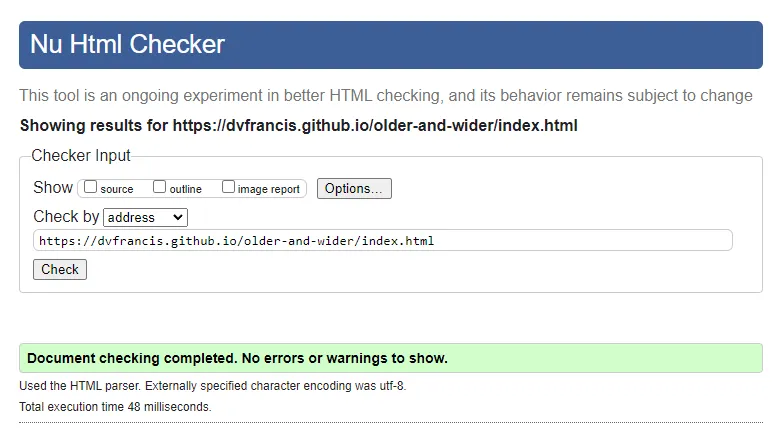
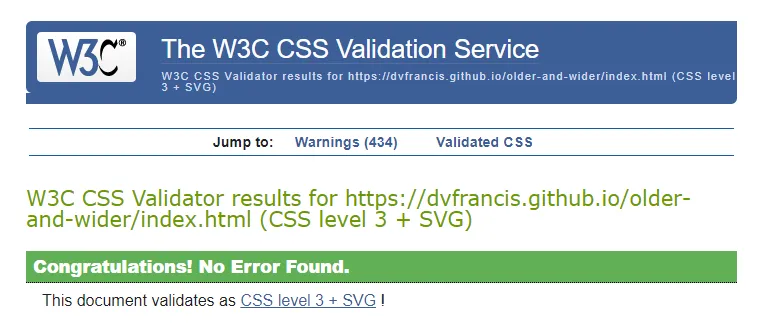

### mailing-list-completion.html

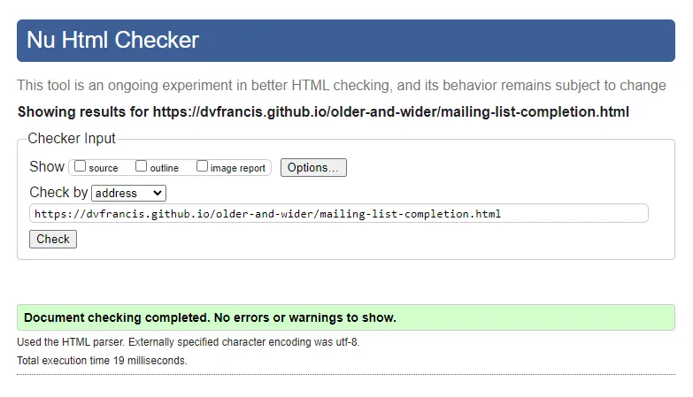
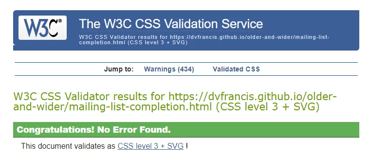

### about.html

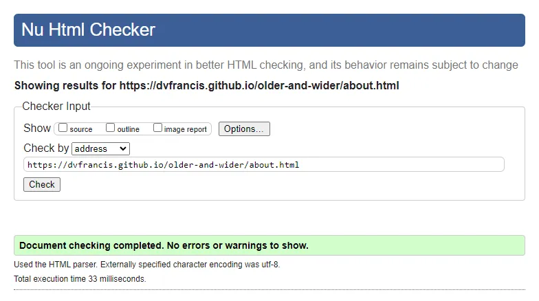
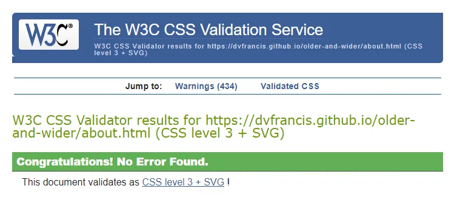

### message-board.html

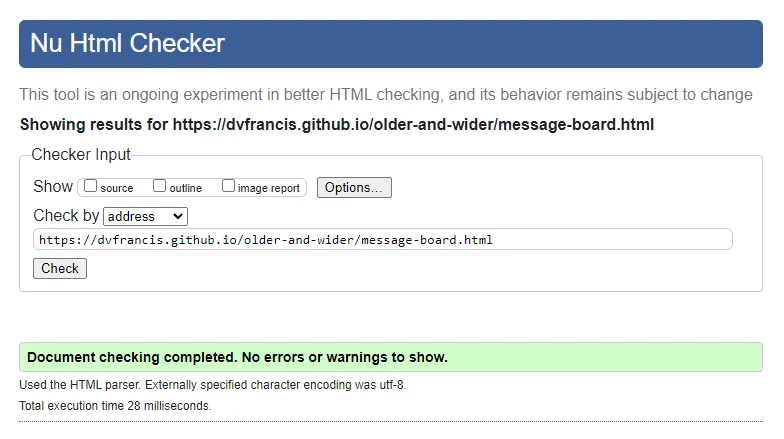
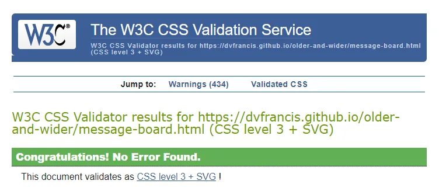

### contact.html

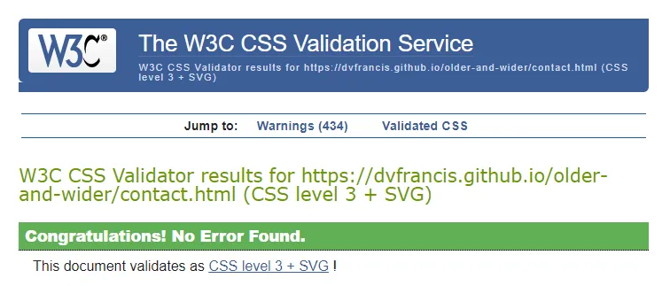

### contact-completion.html

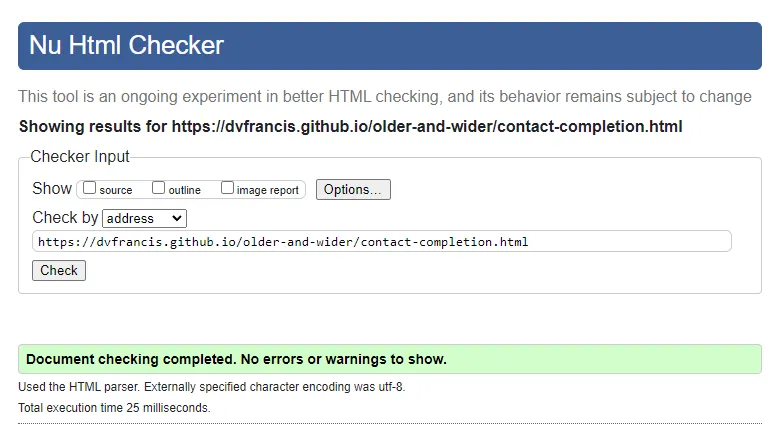
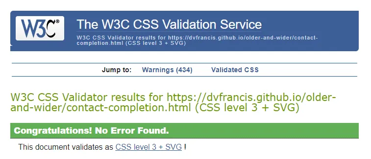

### 404.html

## Manual Validation

A manual test of all links and form fields:

### index.html

| feature | action | expected result | tested | passed | comments |
| --- | --- | --- | --- | --- | --- |
| Navbar | | | | | |
| Home | Click on the "Home" link | The user is redirected to the main page | Yes | Yes | - |

### mailing-list-completion.html

| feature | action | expected result | tested | passed | comments |
| --- | --- | --- | --- | --- | --- |
| Navbar | | | | | |
| Home | Click on the "Home" link | The user is redirected to the main page | Yes | Yes | - |

### about.html

| feature | action | expected result | tested | passed | comments |
| --- | --- | --- | --- | --- | --- |
| Navbar | | | | | |
| Home | Click on the "Home" link | The user is redirected to the main page | Yes | Yes | - |

### message-board.html

| feature | action | expected result | tested | passed | comments |
| --- | --- | --- | --- | --- | --- |
| Navbar | | | | | |
| Home | Click on the "Home" link | The user is redirected to the main page | Yes | Yes | - |

### contact.html

| feature | action | expected result | tested | passed | comments |
| --- | --- | --- | --- | --- | --- |
| Navbar | | | | | |
| Home | Click on the "Home" link | The user is redirected to the main page | Yes | Yes | - |

### contact-completion.html

| feature | action | expected result | tested | passed | comments |
| --- | --- | --- | --- | --- | --- |
| Navbar | | | | | |
| Home | Click on the "Home" link | The user is redirected to the main page | Yes | Yes | - |

### 404.html

| feature | action | expected result | tested | passed | comments |
| --- | --- | --- | --- | --- | --- |
| Navbar | | | | | |
| Home | Click on the "Home" link | The user is redirected to the main page | Yes | Yes | - |

## User Story Validation

Illustrate how the user story is fulfilled.
Present in tabular format as per https://github.com/4n4ru/CI_MS1_BodelschwingherHof.

## Browser Compatibility

Test deployed site in various browsers.
Could use animated GIFs to show results.

## Accessibility

Test deployed site using https://wave.webaim.org

## Responsiveness

Test deployed site for various device sizes using the Responsive Website Design Tester.

## Performance

Audit each page in Google Lighthouse.

## Bugs

List all bugs encountered while coding.
Could use GitHub Issues to keep track of any issues (see Lewis Dillon's README for more information).
List any known, but unfixed bugs - and why they couldn’t be fixed or recreated - or confirm there are none.
Could also list any mistakes made during project, such as using the wrong tense on commit messages.

## Unfixed Bugs

Mention unfixed bugs and why they were not fixed.
Include shortcomings of the frameworks or technologies used.
Lack of time, and difficulty understanding implementation are not valid reasons to leave bugs unfixed.
