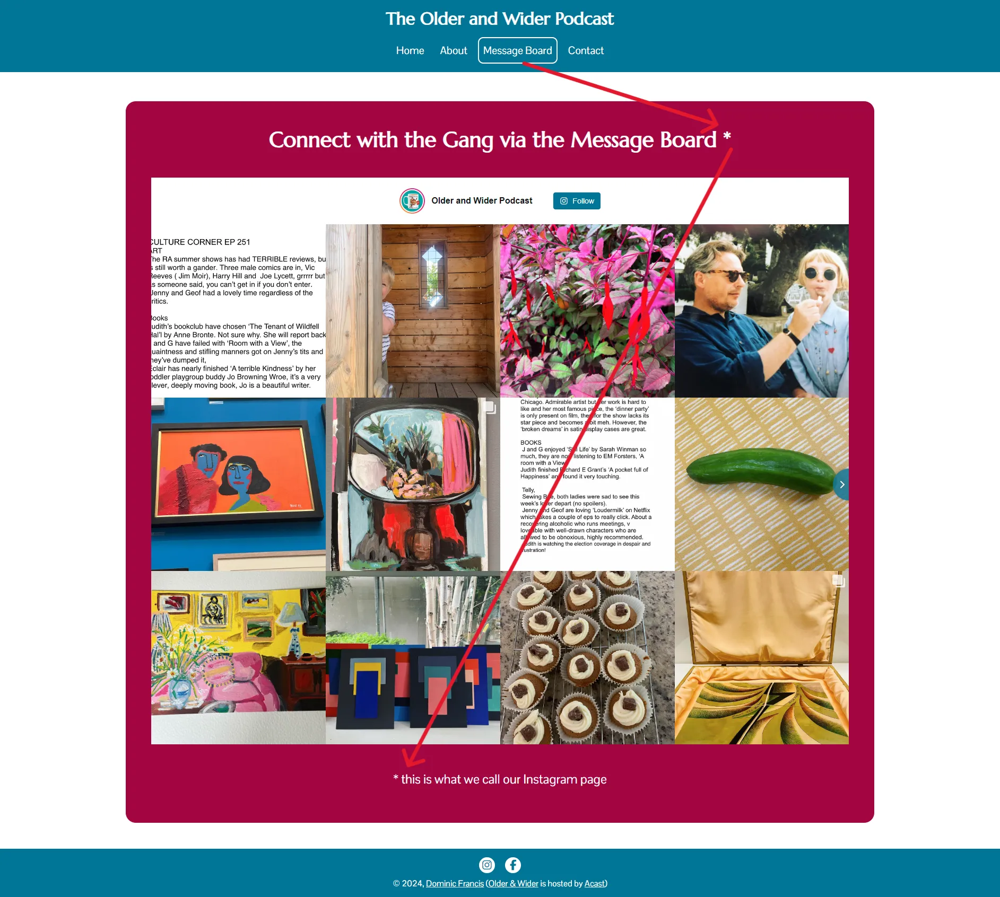
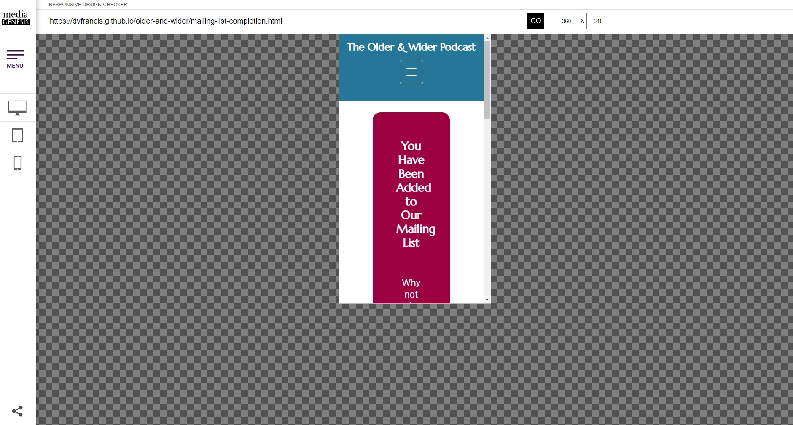
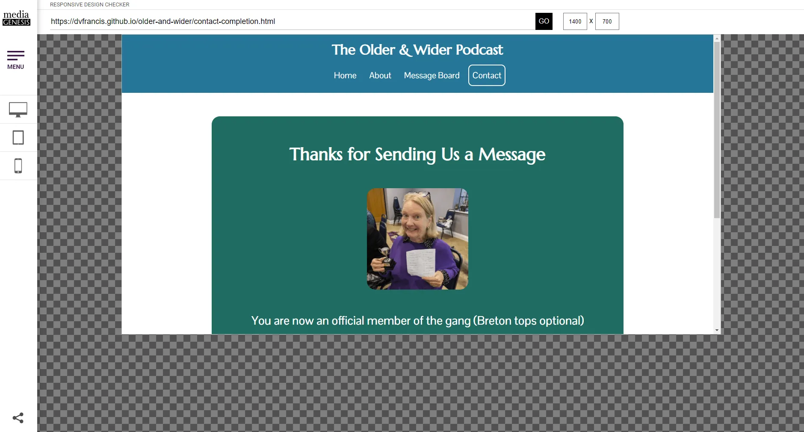
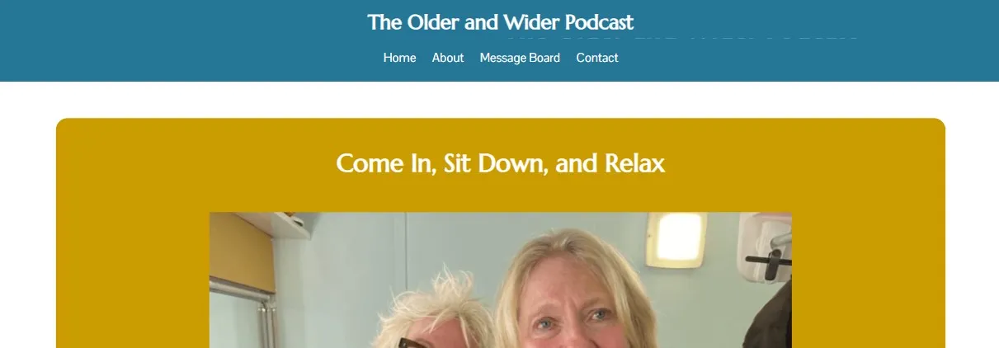

[Return to Older & Wider README.md](https://github.com/dvfrancis/older-and-wider/blob/main/README.md)

# Testing

## Index

1. [Code Validation](#code-validation)
    1. [HTML](#html)
        1. [index.html](#indexhtml)
        2. [mailing-list-completion.html](#mailing-list-completionhtml)
        3. [about.html](#abouthtml)
        4. [message-board.html](#message-boardhtml)
        5. [contact.html](#contacthtml)
        6. [contact-completion.html](#contact-completionhtml)
        7. [404.html](#404html)
    2. [CSS](#css)
        1. [index.html](#indexhtml-1)
        2. [mailing-list-completion.html](#mailing-list-completionhtml-1)
        3. [about.html](#abouthtml-1)
        4. [message-board.html](#message-boardhtml-1)
        5. [contact.html](#contacthtml-1)
        6. [contact-completion.html](#contact-completionhtml-1)
        7. [404.html](#404html-1)
2. [Manual Validation](#manual-validation)
    1. [index.html](#indexhtml-2)
    2. [mailing-list-completion.html](#mailing-list-completionhtml-2)
    3. [about.html](#abouthtml-2)
    4. [message-board.html](#message-boardhtml-2)
    5. [contact.html](#contacthtml-2)
    6. [contact-completion.html](#contact-completionhtml-2)
    7. [404.html](#404html-2)
3. [User Story Validation](#user-story-validation)
    1. [First Time Visitor Goals](#first-time-visitor-goals)
    2. [Returning Visitor Goals](#returning-visitor-goals)
    3. [Frequent Visitor Goals](#frequent-visitor-goals)
4. [Browser Compatibility](#browser-compatibility)
    1. [Google Chrome](#google-chrome)
    2. [Microsoft Edge](#microsoft-edge)
    3. [Firefox](#firefox)
    4. [Opera](#opera)
5. [Accessibility](#accessibility)
    1. [index.html](#404html-3)
    2. [mailing-list-completion.html](#mailing-list-completionhtml-3)
    3. [about.html](#abouthtml-3)
    4. [message-board.html](#message-boardhtml-3)
    5. [contact.html](#contact-completionhtml-3)
    6. [contact-completion.html](#contact-completionhtml-3)
    7. [404.html](#404html-3)
6. [Responsiveness](#responsiveness)
    1. [index.html](#indexhtml-4)
    2. [mailing-list-completion.html](#mailing-list-completionhtml-4)
    3. [about.html](#abouthtml-4)
    4. [message-board.html](#message-boardhtml-4)
    5. [contact.html](#contacthtml-4)
    6. [contact-completion.html](#contact-completionhtml-4)
    7. [404.html](#404html-4)
7. [Performance](#performance)
    1. [index.html](#indexhtml-5)
    2. [mailing-list-completion.html](#mailing-list-completionhtml-5)
    3. [about.html](#abouthtml-5)
    4. [message-board.html](#message-boardhtml-5)
    5. [contact.html](#contacthtml-5)
    6. [contact-completion.html](#contact-completionhtml-5)
    7. [404.html](#404html-5)
8. [Bugs](#bugs)
9. [Unfixed Bugs](#unfixed-bugs)

## Code Validation

### HTML

Below are the results of HTML validation for each page, using the [W3C Markup Validation Service](https://validator.w3.org):

#### index.html

#### mailing-list-completion.html

#### about.html

#### message-board.html

#### contact.html

#### contact-completion.html

#### 404.html

### CSS

Below are the results of CSS validation for each page, using the [W3C CSS Validation Service](https://jigsaw.w3.org/css-validator). There were no warnings for the local CSS file, but warnings were generated for Bootstrap's CSS file, over which I have no control:

#### index.html

#### mailing-list-completion.html

#### about.html

#### message-board.html

#### contact.html

#### contact-completion.html

#### 404.html

## Manual Validation

Here are the results of a manual test of all links, and any form fields, for each page:

### index.html

| ITEM | PROCESS | EXPECTED RESULT | ACTUAL RESULT | STATUS |
| --- | --- | --- | --- | --- |
| Site title - "The Older & Wider Podcast" | Click to return to index.html | The user is redirected to index.html (even if already there) | The user is redirected to index.html (even if already there) | PASS |
| Navigation bar link - "Home" | Click to open index.html | The user is redirected to index.html (even if already there) | The user is redirected to index.html (even if already there) | PASS |
| Navigation bar link - "About" | Click to open about.html | The user is redirected to about.html (even if already there) | The user is redirected to about.html (even if already there) | PASS |
| Navigation bar link - "Message Board" | Click to open message-board.html | The user is redirected to message-board.html (even if already there) | The user is redirected to message-board.html (even if already there) | PASS |
| Navigation bar link - "Contact"" | Click to open contact.html | The user is redirected to contact.html (even if already there) | The user is redirected to contact.html (even if already there) | PASS |
| Image carousel | Use arrow and indicator controls to move between all image slides | Slides transition succesfully | Slides transition succesfully | PASS |
| Button - "About the Podcast" | Click to move to about.html | The user is redirected to the about page | The user is redirected to the about page | PASS |
| Podcast player | Click play to play the podcast, and then click pause to pause playback | Playback begins or ends | Playback begins or ends | PASS |
| Button - "Buy Tickets" | Click to open external website in new tab | The link opens in a new tab | The link opens in a new tab | PASS |
| Button - "See the Merch" | Click to open external website in new tab | The link opens in a new tab | The link opens in a new tab | PASS |
| "Mailing List" - using a valid email | Enter a valid email address and click 'Send' | The email address is accepted and the user redirected to mailing-list-completion.html  | The email is accepted and the user is redirected to mailing-list-completion.html | PASS |
| "Mailing List" - using an invalid email | Enter an invalid email address and click 'Send' | The email address is rejected  | The email is rejected | PASS |
| Social media icon - Instagram | Click to open the Older & Wider Instagram page in a new tab  | The link opens in a new tab  | The link opens in a new tab | PASS |
| Social media icon - Facebook | Click to open the Older & Wider Facebook page in a new tab  | The link opens in a new tab  | The link opens in a new tab | PASS |
| Footer link - "Dominic Francis" | Click to open dominicfrancis.co.uk in a new tab | The link opens in a new tab  | The link opens in a new tab | PASS |
| Footer link - "Older & Wider" | Click to open the Acast Older & Wider website in a new tab | The link opens in a new tab  | The link opens in a new tab | PASS |
| Footer link - "Acast" | Click to open the Acast website in a new tab | The link opens in a new tab  | The link opens in a new tab | PASS |

### mailing-list-completion.html

| ITEM | PROCESS | EXPECTED RESULT | ACTUAL RESULT | STATUS |
| --- | --- | --- | --- | --- |
| Site title - "The Older & Wider Podcast" | Click to return to index.html | The user is redirected to index.html (even if already there) | The user is redirected to index.html (even if already there) | PASS |
| Navigation bar link - "Home" | Click to open index.html | The user is redirected to index.html (even if already there) | The user is redirected to index.html (even if already there) | PASS |
| Navigation bar link - "About" | Click to open about.html | The user is redirected to about.html (even if already there) | The user is redirected to about.html (even if already there) | PASS |
| Navigation bar link - "Message Board" | Click to open message-board.html | The user is redirected to message-board.html (even if already there) | The user is redirected to message-board.html (even if already there) | PASS |
| Navigation bar link - "Contact"" | Click to open contact.html | The user is redirected to contact.html (even if already there) | The user is redirected to contact.html (even if already there) | PASS |
| Auto redirect (after 30 seconds) | The page is automatically redirected to index.html after 30 seconds have elapsed | The index.html page loads after 30 seconds | The index.html page loads after 30 seconds | PASS |
| Button - "Return to the home page" | Click to move to index.html | The user is redirected to the home page | The user is redirected to the home page | PASS |
| Button - "Learn about the podcast" | Click to move to about.html | The user is redirected to the about page | The user is redirected to the about page | PASS |
| Button - "View the 'Message Board'" | Click to move to message-board.html | The user is redirected to the message board page | The user is redirected to the message board page | PASS |
| Button - "Why not send us a message?" | Click to move to contact.html | The user is redirected to the contact page | The user is redirected to the contact page | PASS |
| Social media icon - Instagram | Click to open the Older & Wider Instagram page in a new tab  | The link opens in a new tab  | The link opens in a new tab | PASS |
| Social media icon - Facebook | Click to open the Older & Wider Facebook page in a new tab  | The link opens in a new tab  | The link opens in a new tab | PASS |
| Footer link - "Dominic Francis" | Click to open dominicfrancis.co.uk in a new tab | The link opens in a new tab  | The link opens in a new tab | PASS |
| Footer link - "Older & Wider" | Click to open the Acast Older & Wider website in a new tab | The link opens in a new tab  | The link opens in a new tab | PASS |
| Footer link - "Acast" | Click to open the Acast website in a new tab | The link opens in a new tab  | The link opens in a new tab | PASS |

### about.html

| ITEM | PROCESS | EXPECTED RESULT | ACTUAL RESULT | STATUS |
| --- | --- | --- | --- | --- |
| Site title - "The Older & Wider Podcast" | Click to return to index.html | The user is redirected to index.html (even if already there) | The user is redirected to index.html (even if already there) | PASS |
| Navigation bar link - "Home" | Click to open index.html | The user is redirected to index.html (even if already there) | The user is redirected to index.html (even if already there) | PASS |
| Navigation bar link - "About" | Click to open about.html | The user is redirected to about.html (even if already there) | The user is redirected to about.html (even if already there) | PASS |
| Navigation bar link - "Message Board" | Click to open message-board.html | The user is redirected to message-board.html (even if already there) | The user is redirected to message-board.html (even if already there) | PASS |
| Navigation bar link - "Contact"" | Click to open contact.html | The user is redirected to contact.html (even if already there) | The user is redirected to contact.html (even if already there) | PASS |
| Image carousel for "What is Older & Wider?" | Use arrow and indicator controls to move between all image slides | Slides transition succesfully | Slides transition succesfully | PASS |
| Image carousel for "Who is Judith Holder" | Use arrow and indicator controls to move between all image slides | Slides transition succesfully | Slides transition succesfully | PASS |
| Image carousel for "Who is Jenny Eclair?" | Use arrow and indicator controls to move between all image slides | Slides transition succesfully | Slides transition succesfully | PASS |
| Social media icon - Instagram | Click to open the Older & Wider Instagram page in a new tab  | The link opens in a new tab  | The link opens in a new tab | PASS |
| Social media icon - Facebook | Click to open the Older & Wider Facebook page in a new tab  | The link opens in a new tab  | The link opens in a new tab | PASS |
| Footer link - "Dominic Francis" | Click to open dominicfrancis.co.uk in a new tab | The link opens in a new tab  | The link opens in a new tab | PASS |
| Footer link - "Older & Wider" | Click to open the Acast Older & Wider website in a new tab | The link opens in a new tab  | The link opens in a new tab | PASS |
| Footer link - "Acast" | Click to open the Acast website in a new tab | The link opens in a new tab  | The link opens in a new tab | PASS |

### message-board.html

| ITEM | PROCESS | EXPECTED RESULT | ACTUAL RESULT | STATUS |
| --- | --- | --- | --- | --- |
| Site title - "The Older & Wider Podcast" | Click to return to index.html | The user is redirected to index.html (even if already there) | The user is redirected to index.html (even if already there) | PASS |
| Navigation bar link - "Home" | Click to open index.html | The user is redirected to index.html (even if already there) | The user is redirected to index.html (even if already there) | PASS |
| Navigation bar link - "About" | Click to open about.html | The user is redirected to about.html (even if already there) | The user is redirected to about.html (even if already there) | PASS |
| Navigation bar link - "Message Board" | Click to open message-board.html | The user is redirected to message-board.html (even if already there) | The user is redirected to message-board.html (even if already there) | PASS |
| Navigation bar link - "Contact"" | Click to open contact.html | The user is redirected to contact.html (even if already there) | The user is redirected to contact.html (even if already there) | PASS |
| Instagram embed - "Older and Wider Podcast" header | Click to open the Older & Wider Instagram page in a new tab | The link opens in a new tab  | The link opens in a new tab | PASS |
| Instagram embed button - "Follow" | Click to open the Older & Wider Instagram page in a new tab | The link opens in a new tab  | The link opens in a new tab | PASS |
| Instagram embed - load more posts | Click navigation arrows on either side of the instagram embed to load more posts | More posts slide into view  | More posts slide into view | PASS |
| Instagram embed - view post | Click a post to open it in a pop-up window | The post opens in a pop-up window  | The post opens in a pop-up window | PASS |
| Instagram embed - scroll posts | Use a mouse wheel (on desktop) or a finger (on mobile) to scroll down through other posts, from within a post's pop-up window | Further posts are shown  | Further posts are shown | PASS |
| Instagram embed - close post | Use a mouse wheel (on desktop) or a finger (on mobile) to click the cross in the top-right of a post's pop-up window | The post's pop-up window closes  | The post's pop-up window closes | PASS |
| Social media icon - Instagram | Click to open the Older & Wider Instagram page in a new tab  | The link opens in a new tab  | The link opens in a new tab | PASS |
| Social media icon - Facebook | Click to open the Older & Wider Facebook page in a new tab  | The link opens in a new tab  | The link opens in a new tab | PASS |
| Footer link - "Dominic Francis" | Click to open dominicfrancis.co.uk in a new tab | The link opens in a new tab  | The link opens in a new tab | PASS |
| Footer link - "Older & Wider" | Click to open the Acast Older & Wider website in a new tab | The link opens in a new tab  | The link opens in a new tab | PASS |
| Footer link - "Acast" | Click to open the Acast website in a new tab | The link opens in a new tab  | The link opens in a new tab | PASS |

### contact.html

| ITEM | PROCESS | EXPECTED RESULT | ACTUAL RESULT | STATUS |
| --- | --- | --- | --- | --- |
| Site title - "The Older & Wider Podcast" | Click to return to index.html | The user is redirected to index.html (even if already there) | The user is redirected to index.html (even if already there) | PASS |
| Navigation bar link - "Home" | Click to open index.html | The user is redirected to index.html (even if already there) | The user is redirected to index.html (even if already there) | PASS |
| Navigation bar link - "About" | Click to open about.html | The user is redirected to about.html (even if already there) | The user is redirected to about.html (even if already there) | PASS |
| Navigation bar link - "Message Board" | Click to open message-board.html | The user is redirected to message-board.html (even if already there) | The user is redirected to message-board.html (even if already there) | PASS |
| Navigation bar link - "Contact"" | Click to open contact.html | The user is redirected to contact.html (even if already there) | The user is redirected to contact.html (even if already there) | PASS |
| Contact form - "First Name" | Where all other fields are empty, enter first name and click send | The user is prompted to enter their last name  | The user is prompted to enter their last name | PASS |
| Contact form - "Last Name" | Where all other fields are empty, except the first name, enter last name and click send | The user is prompted to enter their age  | The user is prompted to enter their age | PASS |
| Contact form - "Age" | Where all other fields are empty, except the first and last names, enter age and click send | The user is prompted to enter their email address  | The user is prompted to enter their email address | PASS |
| Contact form - "Email" - using an invalid email address | Where all other fields are empty, except the first name, last name, and age, enter an invalid email address and click 'Send' | The email address is rejected  | The email is rejected | PASS |
| Contact form - "Email" - using a valid email address | Where all other fields are empty, except the first name, last name, and age, enter a valid email address and click 'Send' | The user is prompted to enter a message  | The user is prompted to enter a message | PASS |
| Contact form - "Message" | Where all fields are completed correctly, enter a message and click 'Send' | The form is accepted and the user redirected to contact-completion.html  | The form is accepted and the user redirected to contact-completion.html | PASS |
| Contact form button - "Send" | Where all fields are completed correctly, click 'Send' | The form is accepted and the user redirected to contact-completion.html  | The form is accepted and the user redirected to contact-completion.html | PASS |
| Contact form button - "Reset" | Enter any information on the form, and click 'Reset' | The information on the form is cleared, ready for fresh data entry  | The information on the form is cleared, ready for fresh data entry | PASS |
| Social media icon - Instagram | Click to open the Older & Wider Instagram page in a new tab  | The link opens in a new tab  | The link opens in a new tab | PASS |
| Social media icon - Facebook | Click to open the Older & Wider Facebook page in a new tab  | The link opens in a new tab  | The link opens in a new tab | PASS |
| Footer link - "Dominic Francis" | Click to open dominicfrancis.co.uk in a new tab | The link opens in a new tab  | The link opens in a new tab | PASS |
| Footer link - "Older & Wider" | Click to open the Acast Older & Wider website in a new tab | The link opens in a new tab  | The link opens in a new tab | PASS |
| Footer link - "Acast" | Click to open the Acast website in a new tab | The link opens in a new tab  | The link opens in a new tab | PASS |

### contact-completion.html

| ITEM | PROCESS | EXPECTED RESULT | ACTUAL RESULT | STATUS |
| --- | --- | --- | --- | --- |
| Site title - "The Older & Wider Podcast" | Click to return to index.html | The user is redirected to index.html (even if already there) | The user is redirected to index.html (even if already there) | PASS |
| Navigation bar link - "Home" | Click to open index.html | The user is redirected to index.html (even if already there) | The user is redirected to index.html (even if already there) | PASS |
| Navigation bar link - "About" | Click to open about.html | The user is redirected to about.html (even if already there) | The user is redirected to about.html (even if already there) | PASS |
| Navigation bar link - "Message Board" | Click to open message-board.html | The user is redirected to message-board.html (even if already there) | The user is redirected to message-board.html (even if already there) | PASS |
| Navigation bar link - "Contact"" | Click to open contact.html | The user is redirected to contact.html (even if already there) | The user is redirected to contact.html (even if already there) | PASS |
| Auto redirect (after 30 seconds) | The page is automatically redirected to index.html after 30 seconds have elapsed | The index.html page loads after 30 seconds | The index.html page loads after 30 seconds | PASS |
| Button - "Return to the home page" | Click to move to index.html | The user is redirected to the home page | The user is redirected to the home page | PASS |
| Button - "Learn about the podcast" | Click to move to about.html | The user is redirected to the about page | The user is redirected to the about page | PASS |
| Button - "View the 'Message Board'" | Click to move to message-board.html | The user is redirected to the message board page | The user is redirected to the message board page | PASS |
| Social media icon - Instagram | Click to open the Older & Wider Instagram page in a new tab  | The link opens in a new tab  | The link opens in a new tab | PASS |
| Social media icon - Facebook | Click to open the Older & Wider Facebook page in a new tab  | The link opens in a new tab  | The link opens in a new tab | PASS |
| Footer link - "Dominic Francis" | Click to open dominicfrancis.co.uk in a new tab | The link opens in a new tab  | The link opens in a new tab | PASS |
| Footer link - "Older & Wider" | Click to open the Acast Older & Wider website in a new tab | The link opens in a new tab  | The link opens in a new tab | PASS |
| Footer link - "Acast" | Click to open the Acast website in a new tab | The link opens in a new tab  | The link opens in a new tab | PASS |

### 404.html

| ITEM | PROCESS | EXPECTED RESULT | ACTUAL RESULT | STATUS |
| --- | --- | --- | --- | --- |
| Site title - "The Older & Wider Podcast" | Click to return to index.html | The user is redirected to index.html (even if already there) | The user is redirected to index.html (even if already there) | PASS |
| Navigation bar link - "Home" | Click to open index.html | The user is redirected to index.html (even if already there) | The user is redirected to index.html (even if already there) | PASS |
| Navigation bar link - "About" | Click to open about.html | The user is redirected to about.html (even if already there) | The user is redirected to about.html (even if already there) | PASS |
| Navigation bar link - "Message Board" | Click to open message-board.html | The user is redirected to message-board.html (even if already there) | The user is redirected to message-board.html (even if already there) | PASS |
| Navigation bar link - "Contact"" | Click to open contact.html | The user is redirected to contact.html (even if already there) | The user is redirected to contact.html (even if already there) | PASS |
| Auto redirect (after 30 seconds) | The page is automatically redirected to index.html after 30 seconds have elapsed | The index.html page loads after 30 seconds | The index.html page loads after 30 seconds | PASS |
| Button - "Return to the home page" | Click to move to index.html | The user is redirected to the home page | The user is redirected to the home page | PASS |
| Button - "Learn about the podcast" | Click to move to about.html | The user is redirected to the about page | The user is redirected to the about page | PASS |
| Button - "View the 'Message Board'" | Click to move to message-board.html | The user is redirected to the message board page | The user is redirected to the message board page | PASS |
| Button - "Why not send us a message?" | Click to move to contact.html | The user is redirected to the contact page | The user is redirected to the contact page | PASS |
| Social media icon - Instagram | Click to open the Older & Wider Instagram page in a new tab  | The link opens in a new tab  | The link opens in a new tab | PASS |
| Social media icon - Facebook | Click to open the Older & Wider Facebook page in a new tab  | The link opens in a new tab  | The link opens in a new tab | PASS |
| Footer link - "Dominic Francis" | Click to open dominicfrancis.co.uk in a new tab | The link opens in a new tab  | The link opens in a new tab | PASS |
| Footer link - "Older & Wider" | Click to open the Acast Older & Wider website in a new tab | The link opens in a new tab  | The link opens in a new tab | PASS |
| Footer link - "Acast" | Click to open the Acast website in a new tab | The link opens in a new tab  | The link opens in a new tab | PASS |

## User Story Validation

### First Time Visitor Goals

1. "What is the Older and Wider podcast about?"

| ITEM | PROCESS | EXPECTED RESULT | ACTUAL RESULT | STATUS |
| --- | --- | --- | --- | --- |
| About page | Navigate to the about page using the navigation bar at the top of each page, and scroll down to the section called "What is Older & Wider?" | View information about the podcast | View information about the podcast | PASS |

2. "Who is Jenny Eclair?"

| ITEM | PROCESS | EXPECTED RESULT | ACTUAL RESULT | STATUS |
| --- | --- | --- | --- | --- |
| About page | Navigate to the about page using the navigation bar at the top of each page, and scroll down to the section called "Who is Jenny Eclair?" | View information about Jenny Eclair | View information about Jenny Eclair | PASS | 

3. "Who is Judith Holder?"

| ITEM | PROCESS | EXPECTED RESULT | ACTUAL RESULT | STATUS |
| --- | --- | --- | --- | --- |
| About page | Navigate to the about page using the navigation bar at the top of each page, and scroll down to the section called "Who is Judith Holder?" | View information about Judith Holder | View information about Judith Holder | PASS | 

4. "Where can I listen to the Older and Wider Podcast"

| ITEM | PROCESS | EXPECTED RESULT | ACTUAL RESULT | STATUS |
| --- | --- | --- | --- | --- |
| Home page | Navigate to the home page, , scroll down to the section called "Join the Older & Wider Podcast Gang", and find the links to podcast platforms | Find the info and choose a provider where you can download and listen to the podcast | Find the info and choose a provider where you can download and listen to the podcast | PASS | 
| Home page | Navigate to the home page, scroll down to the section called "Listen to the Podcast", and play the latest episode from the embedded podcast player | Find the podcast player and listen to the latest episode | Find the podcast player and listen to the latest episode | PASS | 

5. "When are episodes of the Older and Wider podcast released?"

| ITEM | PROCESS | EXPECTED RESULT | ACTUAL RESULT | STATUS |
| --- | --- | --- | --- | --- |
| Home page | Navigate to the home page, scroll down to the section called "Join the Older & Wider Podcast Gang", and read about the podcast release date | Find the release date of the podcast | Find the release date of the podcast | PASS | 

### Returning Visitor Goals:

1. "I want to find out more background information about the Older and Wider podcast"

| ITEM | PROCESS | EXPECTED RESULT | ACTUAL RESULT | STATUS |
| --- | --- | --- | --- | --- |
| About page | Navigate to the about page using the navigation bar at the top of each page, and scroll down to the section called "What is Older & Wider?" | View information about the podcast | View information about the podcast | PASS |
| Home page | Navigate to the home page, scroll down to the section called "Mailing List", enter a valid email address, and click the button titled 'Send' to be included on the podcast's mailing list | User is added to the mailing list, and will receive further information via email | User is added to the mailing list, and will receive further information via email | PASS | 

2. "What was mentioned during the 'Culture Corner' segment of this week's show?"

| ITEM | PROCESS | EXPECTED RESULT | ACTUAL RESULT | STATUS |
| --- | --- | --- | --- | --- |
| Message board page | Navigate to the message board page, using the navigation bar at the top of each page, and scroll through the posts on Instagram to find the latest Culture Corner update | Find the latest Culture Corner post and read it | Find the latest Culture Corner post and read it | PASS | 

3. "Has the podcast won any awards?"

| ITEM | PROCESS | EXPECTED RESULT | ACTUAL RESULT | STATUS |
| --- | --- | --- | --- | --- |
| Home page | Navigate to the home page, scroll down to the section called "Join the Older & Wider Podcast Gang", and read about awards for which the podcast has been nominated | Find information about awards | Find information about awards | PASS |

4. "What is the 'Message Board' - it was mentioned by Jenny and Judith in this week's episode, but where can I access it?"

| ITEM | PROCESS | EXPECTED RESULT | ACTUAL RESULT | STATUS |
| --- | --- | --- | --- | --- |
| Message board page | Navigate to the message board page, and read the text under the Instagram embed | Find information about the message board | Find information about the message board | PASS | 

### Frequent Visitor Goals:

1. "How can I contact Jenny and Judith to share my experiences, or comment on an item that was mentioned in the show?"

| ITEM | PROCESS | EXPECTED RESULT | ACTUAL RESULT | STATUS |
| --- | --- | --- | --- | --- |
| Contact page | Navigate to the contact page, and complete the contact form to send a message to the podcast | A message is sent, and the user is redirected to the contact completion page | A message is sent, and the user is redirected to the contact completion page | PASS | 

2. "Is there any podcast merchandise available?"

| ITEM | PROCESS | EXPECTED RESULT | ACTUAL RESULT | STATUS |
| --- | --- | --- | --- | --- |
| Home page | Navigate to the home page, scroll down to the section called "Merch", and click the button titled 'See the Merch' to be taken to the merchandise website (in a new tab) | User can purchase merchandise from an external website | User can purchase merchandise from an external website | PASS | 

3. "Can I watch the podcast being performed live?"

| ITEM | PROCESS | EXPECTED RESULT | ACTUAL RESULT | STATUS |
| --- | --- | --- | --- | --- |
| Home page | Navigate to the home page, scroll down to the section called "Older & Wider - Live!", and click the button titled 'Buy Tickets' to be taken to an external ticketing website (in a new tab) | User can purchase available tickets to a live show, from an external website | User can purchase available tickets to a live show, from an external website | PASS | 

## Browser Compatibility

The website has been successfully tested in the following browsers (desktop screenshots used to allow for a larger preview, except for Safari as there is no Windows version of that browser):

### Google Chrome

### Microsoft Edge

### Firefox

### Opera

### Safari (on an iPad)

### Safari (on an iPhone)

## Accessibility

Pages were tested for accessibility using the [Wave Accessibility Evaluation Tool](https://wave.webaim.org):

### index.html

### mailing-list-completion.html

The error being shown here is because of the auto-redirect setup on the page, which is part of the design:

### about.html

### message-board.html

### contact.html

### contact-completion.html

The error being shown here is because of the auto-redirect setup on the page, which is part of the design:

### 404.html

The error being shown here is because of the auto-redirect setup on the page, which is part of the design:

## Responsiveness

Pages were tested for responsiveness at mobile size (Samsung Galaxy S5/S6/S7 - 360px x 640px), tablet size (Apple iPad Retina - 768px 1024px), and desktop size (1400px x 700px), using the [Responsive Web Design Checker](https://responsivedesignchecker.com/):

### index.html

#### Mobile

#### Tablet

#### Desktop

### mailing-list-completion.html

#### Mobile

#### Tablet

#### Desktop

### about.html

#### Mobile

#### Tablet

#### Desktop

### message-board.html

For some reason, the Instagram widget does not load for this preview, and the social media icons are squashed. This behaviour is not evident when viewing the site on an actual mobile, tablet, or desktop device so I think it is caused by something this website does during testing.

#### Mobile

#### Tablet

#### Desktop

### contact.html

#### Mobile

#### Tablet

#### Desktop

### contact-completion.html

#### Mobile

#### Tablet

#### Desktop

### 404.html

#### Mobile

#### Tablet

#### Desktop

## Performance

Each page was audited using [Google Lighthouse](https://developer.chrome.com/docs/lighthouse/), for both mobile and desktop:

### index.html

#### Mobile

#### Desktop

### mailing-list-completion.html

The lower score for accessibility here is caused by two things - the presence of the redirect (which is part of the site design), and because FontAwesome automatically adds the ``aria-hidden="true"`` class to all of its icons. This cannot be stopped and is conflicting with my own ARIA label on each social media icon. 

#### Mobile

#### Desktop

### about.html

#### Mobile

#### Desktop

### message-board.html

The lower score for performance here is because, among other things, the images being loaded by the Instagram embed are quite large. Unfortunately, I have no control over this, hence the lower score. 

#### Mobile

#### Desktop

### contact.html

#### Mobile

#### Desktop

### contact-completion.html

The lower score for accessibility here is caused by two things - the presence of the redirect (which is part of the site design), and because FontAwesome automatically adds the ``aria-hidden="true"`` class to all of its icons. This cannot be stopped and is conflicting with my own ARIA label on each social media icon. 

#### Mobile

#### Desktop

### 404.html

The lower score for accessibility here is caused by two things - the presence of the redirect (which is part of the site design), and because FontAwesome automatically adds the ``aria-hidden="true"`` class to all of its icons. This cannot be stopped and is conflicting with my own ARIA label on each social media icon. 

#### Mobile

#### Desktop

## Bugs

Here is a list of bugs encountered while building this website. Images shown illustrate the original problem:

| Bug | Fix |
| --- | --- |
| The Fontawesome logos are not centred | Replace original code with Bootstrap classes to organise the icons into rows and columns before applying text-end and text-start to achieve final position |

| Bug | Fix |
| --- | --- |
| The link to the currently loaded page is not highlighted in the navigation bar | Style the pseudo elements - :link, :hover, and :active - to change the navigation links upon use. Add a class called "active" (with the same CSS declarations as :hover) and add to the menu item for the currently active page.

| Bug | Fix |
| --- | --- |
| Navigation bar is not centred or responsive | Centred the menu items using the mx-auto Bootstrap class on the internal navbar container

| Bug | Fix |
| --- | --- |
| Page content is hidden behind fixed header | Created media queries to add padding to the top of the ``body`` element, at different screen resolutions

| Bug | Fix |
| --- | --- |
| Images are too wide at larger resolution | Adjusted the size using a percentage value against ``max-width`` property of the img tag |

| Bug | Fix |
| --- | --- |
| Text is too small at larger screen resolutions | Added Bootstrap classes to manage the text elements at different screen resolutions; for example, fs-4. |

| Bug | Fix |
| --- | --- |
| Contact form is to wide on larger screen resolutions | Needed some adjustment with regards to font size and font weight, using Bootstrap font classes |

| Bug | Fix |
| --- | --- |
| A red line appears underneath the header on the contact.html page, at higher screen resolutions | Accidentally added the ``.feature`` class to the header, which added the red line |

| Bug | Fix |
| --- | --- |
| If you select a navigation link but then drag away from it, it turns black | The pseudo element ``:visited`` had not been formatted for the links. Once it was they remained white as expected. |

| Bug | Fix |
| --- | --- |
| When the site width increases, the padding on buttons seems to increase too, leading to misaligned button text | Removed the height property that had been added to the buttons |

| Bug | Fix |
| --- | --- |
| The Instagram widget used for message-board.html overlaps the fixed footer | The footer is no longer fixed and this solved the issue. If it had remained fixed I believe adjusting the z-index of the widget would also have solved the issue. |

| Bug | Fix |
| --- | --- |
| When I hover over, or click, a navbar link, the other navbar links move ever so slightly (I have exaggerated it for the screenshots so it is easier to see) | Added a default border size to the item when it wasn't being hovered over or clicked. |

.webp)
.webp)
.webp)
.webp)

## Unfixed Bugs

Here is a list of bugs I was unable to fix due to circumstances beyond my control:

| Bug | Fix |
| --- | --- |
| There is a white line beneath the footer | This only occurs in Chromium-based browsers such as Google Chrome and Microsoft Edge; the line does not appear in other browers tested. After discussing this with Code Institute's tutor support we came to the conclusion it was either a problem with that type of browser, or a strange quirk of the computer I am using |

